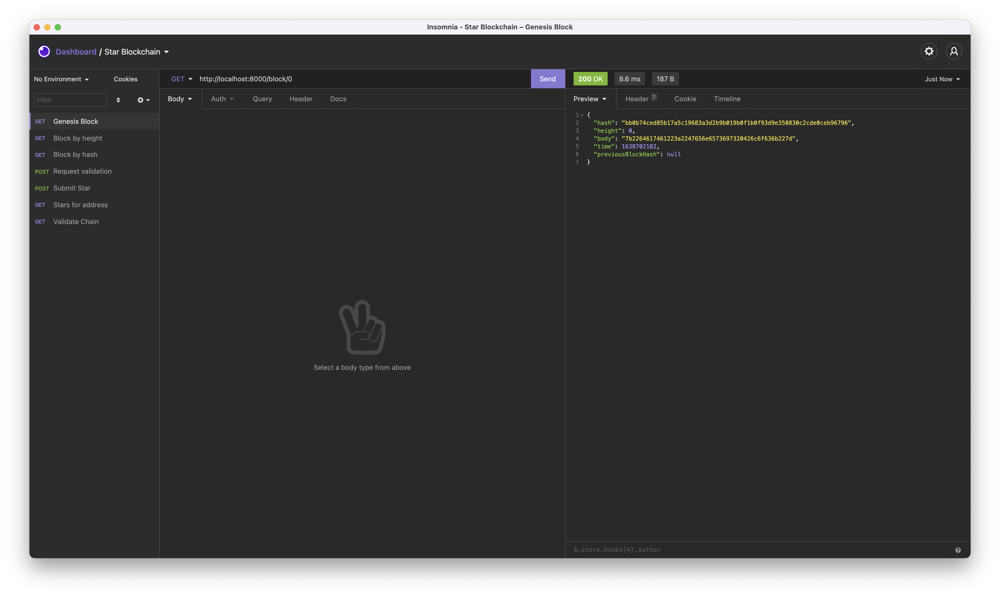
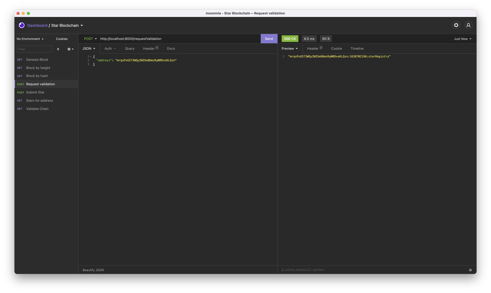
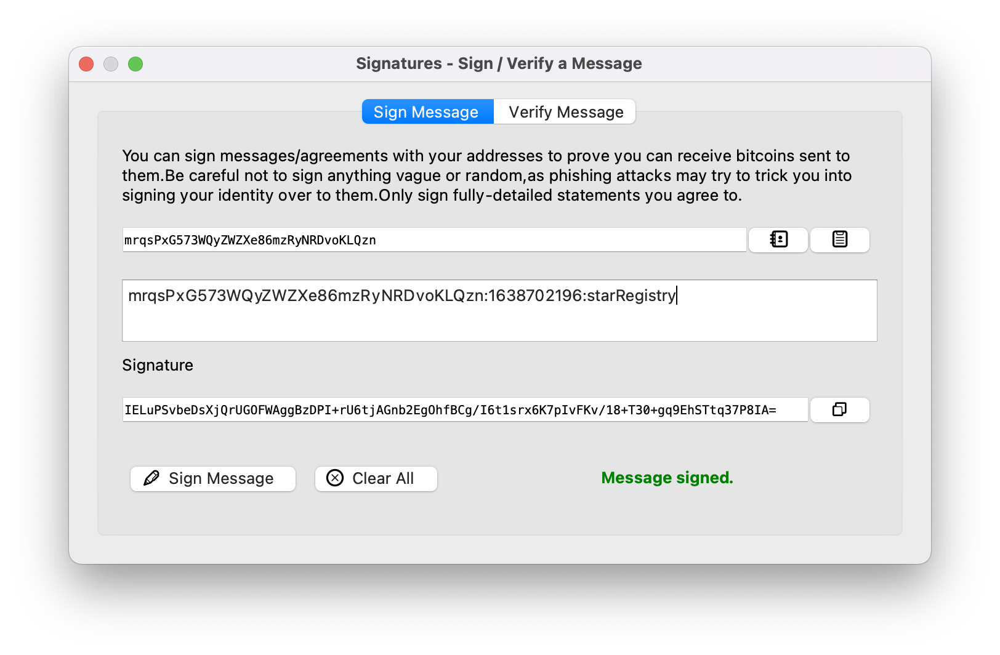
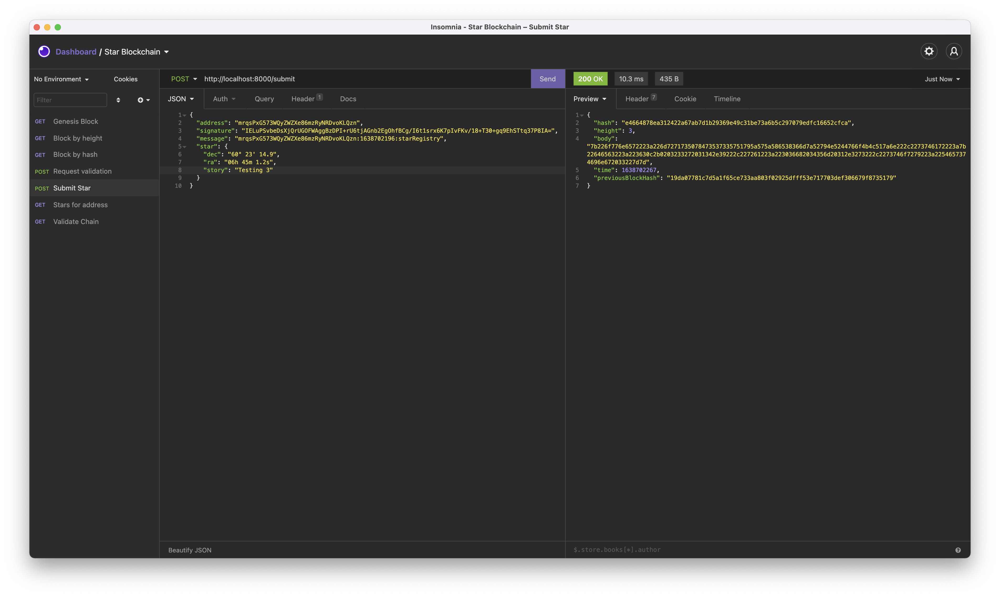
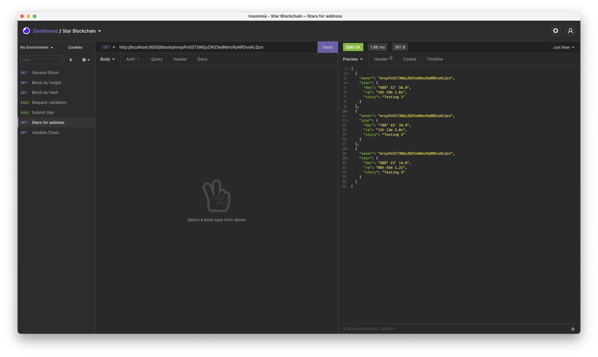
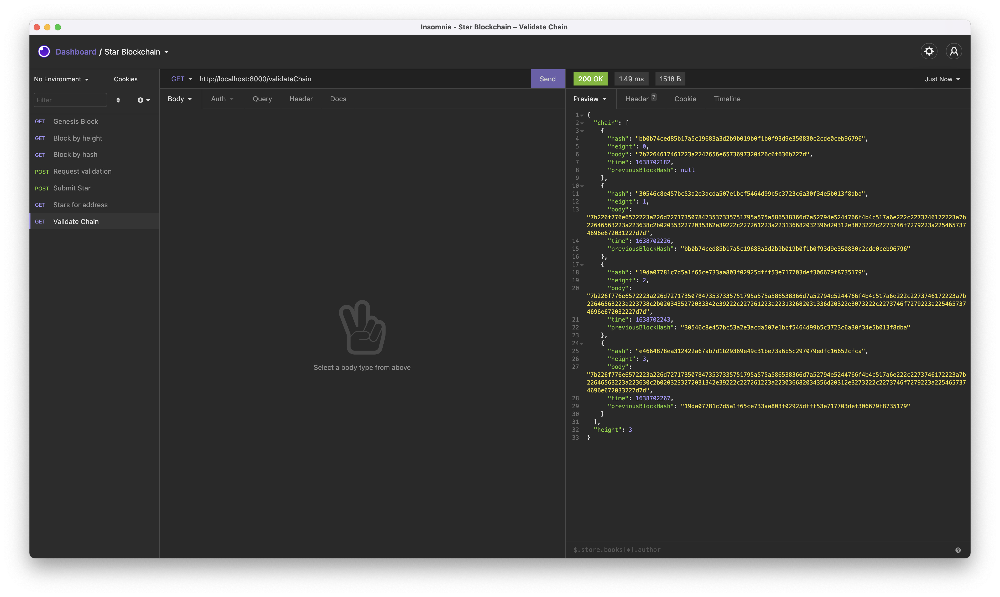

## Complete unfinished block.js implementation

#### Modify the `validate()` function to validate if the block has been tampered or not.

- [x] Return a new promise to allow the method be called asynchronous.
- [x] Create an auxiliary variable and store the current hash of the block in it (this represent the block object)
- [x] Recalculate the hash of the entire block (Use SHA256 from crypto-js library)
- [x] Compare if the auxiliary hash value is different from the calculated one.
- [x] Resolve true or false depending if it is valid or not.

#### Modify the `getBData()` function to return the block body (decoding the data)

- [x] Use hex2ascii module to decode the data
- [x] Because data is a javascript object use JSON.parse(string) to get the Javascript Object
- [x] Resolve with the data and make sure that you don't need to return the data for the genesis block OR reject with an error.

### Complete unfinished blockchain.js implementation

#### Modify the `_addBlock(block)` function to store a block in the chain

- [x] Must return a Promise that will resolve with the block added OR reject if an error happen during the execution.
- [x] Height must be checked to assign the previousBlockHash
  - Assign the timestamp & the correct height
  - Create the block hash and push the block into the chain array.
- [x] Don't for get to update the this.height

#### Modify `requestMessageOwnershipVerification(address)` to allow you to request a message that you will use to sign it with your Bitcoin Wallet (Electrum or Bitcoin Core)

- [x] Must return a Promise that will resolve with the message to be signed

#### Modify `submitStar(address, message, signature, star)` function to register a new Block with the star object into the chain

- [x] Must resolve with the Block added or reject with an error.
- [x] Time elapsed between when the message was sent and the current time must be less that 5 minutes
- [x] Must verify the message with wallet address and signature: `bitcoinMessage.verify(message, address, signature)`
- [x] Must create the block and add it to the chain if verification is valid

#### Modify the `getBlockHeight(hash)` function to retrieve a Block based on the hash parameter

- [x] Must return a Promise that will resolve with the Block

#### Modify the `getStarsByWalletAddress (address)` function to return an array of Stars from an owners collection

- [x] Must return a Promise that will resolve with an array of the owner address' Stars from the chain

#### Modify the `validateChain()` function

- [x] Must return a Promise that will resolve with the list of errors when validating the chain
- [x] Must validate each block using `Block.validate()`
- [x] Each Block should check with the `previousBlockHash`
- [x] Execute the `validateChain()` function every time a block is added
- [x] Сreate an endpoint that will trigger the execution of `validateChain()`

### Test your App functionality

Use `Insomnia` or similar service to test your blockchains endpoints and send screenshots of each call

##### must use a GET call to request the Genesis block

##### must use a POST call to `requestValidation`

##### must sign message with your wallet

#### must submit your Star

#### must use GET call to retrieve starts owned by a particular address

#### must have endpoint to validate chain

